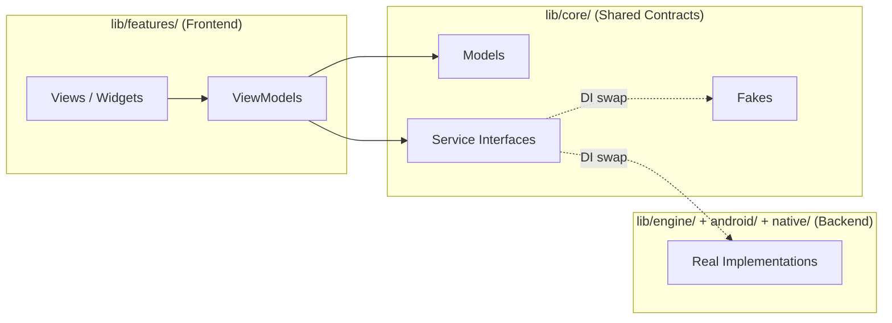
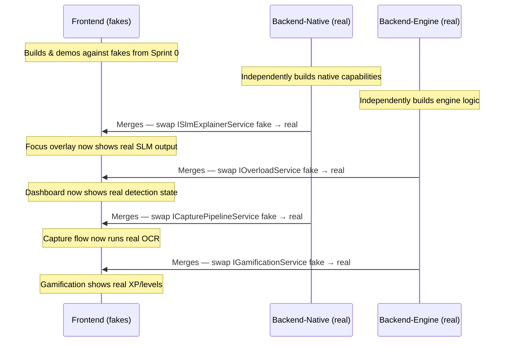

# ATARI — Flutter Frontend PRD

**Product Requirements Document · Frontend Developer Reference**
**Version:** 1.0 · **Date:** 2026-08-29 · **Track:** iQOO City Battles 2026 · Open Innovation

---

## 1. Purpose & Scope

This PRD defines every requirement, architecture rule, screen specification, data contract, and integration boundary for the **Flutter frontend** of ATARI. It is the single source of truth for the frontend developer working on `dev/frontend`.

> [!IMPORTANT]
> **This frontend is completely independent of every backend, model, and native layer.** It builds, runs, and is fully demoable against fake/mock implementations from day one. Real backends are swapped in via dependency injection — never by modifying UI code.

### 1.1 Architectural Mandates (from [frontend_docs/rules.md](file:///c:/Users/Aritra%20Ghosh/Desktop/IQOO%20HACK/Atari/frontend_docs/rules.md))

| Rule | Enforcement |
|---|---|
| **MVVM Architecture** | Every feature module follows `View → ViewModel → Model/Repository`. Views never contain business logic. ViewModels never import Flutter widget classes. |
| **Separation of Concerns** | UI layer (`lib/features/`), engine/domain layer (`lib/engine/`), data/service layer (`lib/core/`) are strictly separated. No cross-layer imports that skip a level. |
| **SOLID Principles** | **S**ingle Responsibility: one class = one reason to change. **O**pen/Closed: extend via new classes, not modifying existing ones. **L**iskov Substitution: fakes and real implementations are interchangeable. **I**nterface Segregation: narrow, role-specific abstract classes. **D**ependency Inversion: all dependencies are abstract interfaces; concrete implementations are injected. |

---

## 2. System Context & Boundaries

### 2.1 ATARI Core Loop (from [architecture.md](file:///c:/Users/Aritra%20Ghosh/Desktop/IQOO%20HACK/Atari/docs/architecture.md))

```
Sense → Model → Detect → Explain → Intervene → Measure → Adapt
```

The frontend **owns** the `Intervene` surface (showing the focus overlay, explanations, gamification UI) and the user-facing transparency into every other step. It **does not own** sensing, modeling, detection, explanation generation, measurement, or adaptation — those belong to the native and engine layers.

### 2.2 What the Frontend Owns

| Boundary | Scope |
|---|---|
| **Files** | `lib/features/**`, `lib/core/theme/**`, `integration_test/**`, `assets/**` |
| **Responsibilities** | Presentation, navigation, user input collection, goal/todo/note CRUD screens, focus session display, capture-flow UI, gamification surfaces, settings, onboarding consent, transparency dashboard |
| **Never Touches** | `android/`, `native/`, `lib/engine/`, `lib/core/database/`, `lib/core/services/` (platform-channel clients) |

### 2.3 What the Frontend Consumes (via Injected Interfaces)

The frontend depends **only on abstract interfaces** defined in `lib/core/models/` and abstract service contracts. It never imports concrete engine, database, or native implementations.



> [!CAUTION]
> **The frontend must NEVER directly instantiate a concrete service, repository, or engine class.** All dependencies flow through abstract interfaces resolved by a DI container (e.g., `get_it` / `provider` / `riverpod`). This is what makes fakes-to-real swaps a one-line change, not a rewrite.

---

## 3. Architecture: MVVM + Clean Layers

### 3.1 Layer Definitions

```
┌─────────────────────────────────────────────────────────┐
│  PRESENTATION LAYER  (lib/features/<feature>/)          │
│  ├── views/        Stateless/Stateful Widgets           │
│  ├── viewmodels/   ChangeNotifier / StateNotifier        │
│  └── widgets/      Reusable feature-specific widgets    │
├─────────────────────────────────────────────────────────┤
│  DOMAIN LAYER  (lib/core/models/ + service interfaces)  │
│  ├── models/       Immutable data classes (contracts)   │
│  ├── services/     Abstract interface definitions       │
│  └── enums/        Shared enumerations                  │
├─────────────────────────────────────────────────────────┤
│  DATA LAYER  (lib/core/database/ + lib/core/services/)  │
│  ├── fakes/        Sprint-0 fake implementations        │
│  ├── repositories/ Concrete data access (engine team)   │
│  └── platform/     Platform channel clients (native)    │
├─────────────────────────────────────────────────────────┤
│  DESIGN SYSTEM  (lib/core/theme/)                       │
│  ├── app_theme.dart       Material theme configuration  │
│  ├── colors.dart          Color palette constants        │
│  ├── typography.dart      Text style definitions         │
│  ├── spacing.dart         Spacing/padding constants      │
│  └── animations.dart      Shared animation configs       │
└─────────────────────────────────────────────────────────┘
```

### 3.2 MVVM Rules

| Rule | Detail |
|---|---|
| **View → ViewModel** | Views observe ViewModel state. Views call ViewModel methods for user actions. Views never call services or repositories directly. |
| **ViewModel → Service Interface** | ViewModels depend only on abstract service interfaces. They expose observable state (`ChangeNotifier.notifyListeners()` / `StateNotifier` state updates). ViewModels never import `package:flutter/...`. |
| **Service Interface → Implementation** | Interfaces are defined in `lib/core/services/`. Implementations live in `lib/core/services/fakes/` (frontend) or `lib/core/services/impl/` (backend teams). Swapped at DI registration, never conditionally inside a ViewModel. |
| **Model = Immutable Data Contract** | Models are immutable (`@immutable` / `freezed`). They carry no behavior, no database annotations, no Flutter dependencies. Defined collaboratively in Sprint 0, additive-only changes after that. |

### 3.3 Dependency Injection Architecture

```dart
// lib/core/di/service_locator.dart

abstract class ServiceLocator {
  static final GetIt _sl = GetIt.instance;

  static void setupFakes() {
    // Called during development — frontend builds against these
    _sl.registerLazySingleton<IOverloadService>(() => FakeOverloadService());
    _sl.registerLazySingleton<IBaselineService>(() => FakeBaselineService());
    _sl.registerLazySingleton<ISlmExplainerService>(() => FakeSlmExplainerService());
    _sl.registerLazySingleton<IGoalContextService>(() => FakeGoalContextService());
    _sl.registerLazySingleton<IGamificationService>(() => FakeGamificationService());
    _sl.registerLazySingleton<ICapturePipelineService>(() => FakeCapturePipelineService());
    _sl.registerLazySingleton<ICalendarService>(() => FakeCalendarService());
    _sl.registerLazySingleton<ISettingsService>(() => FakeSettingsService());
    _sl.registerLazySingleton<IFeedbackLoopService>(() => FakeFeedbackLoopService());
  }

  static void setupReal() {
    // Called at integration — one-line swap per service
    // Backend teams register their real implementations here
  }

  static T get<T extends Object>() => _sl.get<T>();
}
```

> [!TIP]
> **Every ViewModel constructor takes its dependencies as parameters** (constructor injection). The DI container resolves them. This makes unit testing trivial — inject mocks directly, no container needed in tests.

---

## 4. Data Contracts (Sprint 0 Models)

These are the shared immutable models defined in `lib/core/models/`, agreed upon during Sprint 0. The frontend developer **consumes** these — the engine and native teams **produce** data conforming to them.

### 4.1 Core Detection & Intervention Models

```dart
// lib/core/models/overload_event.dart
@immutable
class OverloadEvent {
  final DateTime timestamp;
  final Map<String, double> signalScores;  // signal name → z-score
  final double severity;                    // weighted composite
  final String topSignal;                   // highest contributing signal
  final String baselineContext;             // e.g., "Tuesday afternoon"

  const OverloadEvent({...});
}
```

```dart
// lib/core/models/agent_state.dart
enum AgentState { normal, overloadDetected, intervening, cooldown }
```

```dart
// lib/core/models/intervention_result.dart
@immutable
class InterventionResult {
  final String interventionType;   // "focus_layer" | "notification" | "light_friction"
  final double preSignalLevel;
  final double postSignalLevel;
  final double effectSize;         // fractional reduction (≥0.05 = "worked")
  final DateTime timestamp;

  const InterventionResult({...});
}
```

```dart
// lib/core/models/explanation.dart
@immutable
class Explanation {
  final String sentence;           // SLM-generated one-liner (Qwen3-4B GGUF)
  final List<ContextBullet> contextBullets;
  final DateTime generatedAt;

  const Explanation({...});
}
```

### 4.2 Goal-Context Models

```dart
// lib/core/models/context_bullet.dart
@immutable
class ContextBullet {
  final String source;  // "note" | "todo" | "health" | "calendar" | "capture_history"
  final String text;

  const ContextBullet({...});
}
```

```dart
// lib/core/models/todo_item.dart
@immutable
class TodoItem {
  final String id;
  final String title;
  final String? description;
  final DateTime? deadline;
  final bool isCompleted;
  final DateTime createdAt;

  const TodoItem({...});
}
```

```dart
// lib/core/models/health_target.dart
@immutable
class HealthTarget {
  final String id;
  final String metric;      // e.g., "steps", "water_glasses", "sleep_hours"
  final double threshold;   // target value
  final double? current;    // latest measured value (nullable if not yet tracked)
  final bool isMet;

  const HealthTarget({...});
}
```

```dart
// lib/core/models/note.dart
@immutable
class Note {
  final String id;
  final String text;
  final DateTime createdAt;
  final DateTime updatedAt;

  const Note({...});
}
```

```dart
// lib/core/models/calendar_event.dart
@immutable
class CalendarEvent {
  final String id;
  final String title;
  final DateTime startTime;
  final DateTime endTime;
  final String? location;

  const CalendarEvent({...});
}
```

### 4.3 Capture Models

```dart
// lib/core/models/capture_result.dart
@immutable
class CaptureResult {
  final String rectifiedImagePath;
  final String ocrText;
  final double ocrConfidence;

  const CaptureResult({...});
}
```

```dart
// lib/core/models/captured_item.dart
enum ItemType { note, todo, healthTarget }

@immutable
class CapturedItem {
  final String rawText;
  final ItemType suggestedType;
  final String suggestedTitle;
  final DateTime? suggestedDeadline;
  final double confidence;

  const CapturedItem({...});
}
```

### 4.4 Gamification Models

```dart
// lib/core/models/gamification_state.dart
@immutable
class GamificationState {
  final int totalXp;
  final int level;
  final int xpToNextLevel;
  final int currentStreak;     // non-losable: a missed day pauses, never resets
  final List<Quest> activeQuests;
  final List<Achievement> unlockedAchievements;

  const GamificationState({...});
}
```

```dart
// lib/core/models/quest.dart
@immutable
class Quest {
  final String id;
  final String title;
  final String description;
  final int currentProgress;
  final int targetProgress;
  final int xpReward;
  final bool isCompleted;

  const Quest({...});
}
```

```dart
// lib/core/models/achievement.dart
@immutable
class Achievement {
  final String id;
  final String title;
  final String description;
  final String iconAsset;      // path in assets/
  final DateTime? unlockedAt;  // null if still locked

  const Achievement({...});
}
```

```dart
// lib/core/models/gamification_event.dart
enum GamificationTrigger {
  interventionWorked,
  todoCompleted,
  healthTargetMet,
  captureOrganized,
}

@immutable
class GamificationEvent {
  final GamificationTrigger trigger;
  final int xpAwarded;
  final DateTime timestamp;

  const GamificationEvent({...});
}
```

### 4.5 Signal & Baseline Models

```dart
// lib/core/models/signal_snapshot.dart
@immutable
class SignalSnapshot {
  final int unlockCount;
  final int appSwitchCount;
  final double avgNotifLatencyMs;
  final Map<String, double> zScores;  // per-signal z-score
  final DateTime windowStart;
  final DateTime windowEnd;

  const SignalSnapshot({...});
}
```

```dart
// lib/core/models/baseline_bucket.dart
@immutable
class BaselineBucket {
  final String signal;
  final int hourOfDay;    // 0-23
  final int dayOfWeek;    // 1-7 (Mon-Sun)
  final int sampleCount;
  final double mean;
  final double standardDeviation;

  const BaselineBucket({...});
}
```

---

## 5. Service Interfaces (Dependency Inversion)

Every service the frontend consumes is defined as an abstract interface. The frontend team writes **fakes** for all of these in Sprint 0. Backend teams provide real implementations later — swapped via DI, never by editing UI code.

### 5.1 Interface Definitions

```dart
// lib/core/services/i_overload_service.dart
abstract class IOverloadService {
  Stream<AgentState> get stateStream;
  Stream<OverloadEvent?> get latestOverloadEvent;
  Future<void> simulateOverload();  // debug trigger for demos
}
```

```dart
// lib/core/services/i_baseline_service.dart
abstract class IBaselineService {
  Future<SignalSnapshot> getCurrentSnapshot();
  Future<List<BaselineBucket>> getBuckets({required String signal});
  Stream<SignalSnapshot> get snapshotStream;
}
```

```dart
// lib/core/services/i_slm_explainer_service.dart
abstract class ISlmExplainerService {
  Future<Explanation> generateExplanation(OverloadEvent event);
  Stream<String> generateExplanationStream(OverloadEvent event);  // token-by-token
}
```

```dart
// lib/core/services/i_goal_context_service.dart
abstract class IGoalContextService {
  // Notes (free-text, embedding-backed retrieval)
  Future<List<Note>> getAllNotes();
  Future<Note> createNote(String text);
  Future<Note> updateNote(String id, String text);
  Future<void> deleteNote(String id);

  // Todos (structured, field-query)
  Future<List<TodoItem>> getAllTodos();
  Future<List<TodoItem>> getTodosDueWithin(Duration window);
  Future<TodoItem> createTodo({required String title, String? description, DateTime? deadline});
  Future<TodoItem> updateTodo(TodoItem updated);
  Future<void> completeTodo(String id);
  Future<void> deleteTodo(String id);

  // Health Targets (structured, field-query)
  Future<List<HealthTarget>> getActiveTargets();
  Future<HealthTarget> createTarget({required String metric, required double threshold});
  Future<HealthTarget> updateTarget(HealthTarget updated);
  Future<void> deleteTarget(String id);

  // Calendar (opt-in — may return empty if not connected)
  Future<bool> get isCalendarConnected;
  Future<void> connectCalendar();  // triggers OAuth flow
  Future<void> disconnectCalendar();
  Future<List<CalendarEvent>> getEventsWithin(Duration window);
}
```

```dart
// lib/core/services/i_gamification_service.dart
abstract class IGamificationService {
  Stream<GamificationState> get stateStream;
  Future<GamificationState> getCurrentState();
  Future<List<GamificationEvent>> getRecentEvents({int limit = 20});
  Future<List<Quest>> getActiveQuests();
  Future<List<Achievement>> getAllAchievements();
}
```

```dart
// lib/core/services/i_capture_pipeline_service.dart
abstract class ICapturePipelineService {
  Future<CaptureResult> capture({
    required List<Offset> scribblePoints,
    required String sourceImagePath,
    required CaptureOrigin origin,  // camera | screenshot
  });
  Future<CapturedItem> parseCapture(CaptureResult result);
}

enum CaptureOrigin { camera, screenshot }
```

```dart
// lib/core/services/i_feedback_loop_service.dart
abstract class IFeedbackLoopService {
  Future<List<InterventionResult>> getRecentResults({int limit = 10});
  Stream<InterventionResult> get resultStream;
}
```

```dart
// lib/core/services/i_settings_service.dart
abstract class ISettingsService {
  Future<List<String>> getEssentialApps();
  Future<void> setEssentialApps(List<String> packageNames);
  Future<bool> get isTtsEnabled;
  Future<void> setTtsEnabled(bool enabled);
  Future<bool> get isOnboardingComplete;
  Future<void> setOnboardingComplete(bool complete);
  Future<bool> get hasUsageAccessPermission;
  Future<bool> get hasNotificationAccessPermission;
  Future<void> requestUsageAccess();
  Future<void> requestNotificationAccess();
}
```

### 5.2 Fake Implementations (Sprint 0 Deliverable)

Every fake returns **realistic canned data** with configurable delays to simulate real latency. Example:

```dart
// lib/core/services/fakes/fake_overload_service.dart
class FakeOverloadService implements IOverloadService {
  final _stateController = StreamController<AgentState>.broadcast();
  AgentState _currentState = AgentState.normal;

  @override
  Stream<AgentState> get stateStream => _stateController.stream;

  @override
  Stream<OverloadEvent?> get latestOverloadEvent => /* ... canned event ... */;

  @override
  Future<void> simulateOverload() async {
    await Future.delayed(const Duration(milliseconds: 500));
    _currentState = AgentState.overloadDetected;
    _stateController.add(_currentState);
    // After 2s, auto-transition to intervening
    Future.delayed(const Duration(seconds: 2), () {
      _currentState = AgentState.intervening;
      _stateController.add(_currentState);
    });
  }
}
```

> [!IMPORTANT]
> **Every service interface MUST have a corresponding fake in `lib/core/services/fakes/` before the frontend branch diverges from `main`.** This is the Sprint 0 exit criterion for the frontend developer. Without fakes, frontend work is blocked.

---

## 6. Feature Modules — Screen-by-Screen Specifications

### 6.0 Directory Structure Per Feature

Every feature follows this exact structure:

```
lib/features/<feature_name>/
├── views/
│   └── <feature>_screen.dart          # Top-level screen widget
├── viewmodels/
│   └── <feature>_viewmodel.dart       # ChangeNotifier / StateNotifier
└── widgets/
    └── <feature>_<component>.dart     # Feature-specific reusable widgets
```

### 6.1 Onboarding (`lib/features/onboarding/`)

**Purpose:** First-launch consent and permission setup. Doubles as demo material for the privacy pitch.

| Screen | Content |
|---|---|
| **Welcome Screen** | App logo + tagline ("Empathetic Intelligence for Your Productivity"). Lottie/Rive animation. "Get Started" CTA. |
| **Privacy Consent Screen** | Explicitly lists every signal collected: unlock frequency, app-switch rate, notification response latency. Lists what is NOT collected (notification content, browsing history, app content). "Everything stays on your device" badge. Airplane-mode icon. Must accept to proceed. |
| **Permission Setup Screen** | Step-by-step cards for each required permission: Usage Access, Notification Access, Camera (for capture). Each card: icon + description + "Grant" button that calls `ISettingsService.requestUsageAccess()` etc. Skip-able but with clear warning about reduced functionality. |
| **Essential Apps Screen** | User picks 3 "essential" apps shown during focus mode. Grid/list of installed apps (from `ISettingsService`). Save selection via `ISettingsService.setEssentialApps()`. |
| **Complete Screen** | Confirmation animation. "You're all set" message. Navigate to Dashboard. Mark `ISettingsService.setOnboardingComplete(true)`. |

**ViewModel:** `OnboardingViewModel`
- Tracks current step (0–4)
- Exposes permission states (granted/not granted)
- Calls `ISettingsService` methods
- Never directly invokes Android APIs

### 6.2 Dashboard (`lib/features/dashboard/`)

**Purpose:** The always-available "transparency panel." Shows raw signal state, recent interventions, and measured effectiveness. Explicitly framed as "we score ourselves the way HackTracker scores us."

| Component | Data Source | Content |
|---|---|---|
| **Agent State Banner** | `IOverloadService.stateStream` | Color-coded banner showing current state: Normal (green), Overload Detected (amber), Intervening (red), Cooldown (blue). |
| **Signal Cards** | `IBaselineService.snapshotStream` | 3 cards — Unlocks, App Switches, Notification Latency. Each shows: raw count/value, z-score, baseline mean for current time bucket, mini sparkline chart (last 6 hours). |
| **Intervention History** | `IFeedbackLoopService.getRecentResults()` | Scrollable list of recent interventions: type, timestamp, pre/post signal levels, effect size badge (≥5% = green "Worked", <5% = grey "No effect"). |
| **Gamification Summary** | `IGamificationService.stateStream` | XP bar, current level, streak count (non-losable), latest achievement. Taps through to full gamification screen. |
| **Active Goals Bar** | `IGoalContextService.getTodosDueWithin()` | Horizontal scrollable chips showing upcoming todos/targets. Tap → goals detail screen. |
| **Debug: Simulate Overload** | `IOverloadService.simulateOverload()` | Floating action button (debug builds only, controlled by build config). Triggers a simulated overload event for demo purposes. |

**ViewModel:** `DashboardViewModel`
- Subscribes to `IOverloadService.stateStream`, `IBaselineService.snapshotStream`, `IGamificationService.stateStream`
- Exposes: `AgentState currentState`, `SignalSnapshot? latestSnapshot`, `GamificationState gamification`, `List<InterventionResult> recentInterventions`
- Method: `simulateOverload()` delegates to `IOverloadService`

### 6.3 Focus Overlay (`lib/features/focus/`)

**Purpose:** The full-screen intervention surface. Shows when overload is detected. Muted color scheme, explanation text, TTS voice, 3 essential apps.

| Component | Content |
|---|---|
| **Background** | Full-screen muted/dimmed overlay. Calming gradient (from design system). |
| **Explanation Card** | SLM-generated sentence from `ISlmExplainerService`. Animated text reveal (character-by-character or fade-in). Context bullets below: "📝 Study session due at 3pm", "🎯 Steps target: 8000". |
| **Essential Apps Row** | 3 user-configured app icons (from `ISettingsService.getEssentialApps()`). Tapping launches the app via platform channel. |
| **Dismiss Controls** | "I'm back on track" button → ends intervention, triggers feedback measurement. Optional: light friction (3s delay before dismiss becomes active — stretch goal §7 bandit arm). |
| **TTS Indicator** | Speaker icon with animation showing TTS is reading the explanation aloud. Tap to replay or mute. |

**ViewModel:** `FocusViewModel`
- Receives `OverloadEvent` and triggers `ISlmExplainerService.generateExplanation()`
- Exposes: `Explanation? explanation`, `bool isLoading`, `List<String> essentialApps`
- Method: `dismiss()` → notifies the orchestrator via service interface that intervention ended
- **Does NOT decide whether to show itself** — that decision comes from `IOverloadService.stateStream` transitioning to `AgentState.intervening`

### 6.4 Goals (`lib/features/goals/`)

**Purpose:** CRUD for todos, health targets, and notes. The user's goal data that grounds intervention explanations.

#### 6.4.1 Goals Overview Screen

| Tab | Content |
|---|---|
| **Todos** | List of all todos. Chips: "Active" / "Completed". Each item: title, deadline (if set), checkbox. Swipe-to-delete. FAB → Create Todo. |
| **Health Targets** | List of active targets. Each: metric name, progress bar (current/threshold), "Met" badge if reached. FAB → Create Target. |
| **Notes** | List of all notes. Preview of first 2 lines. Tap → edit. FAB → Create Note. |

#### 6.4.2 Create/Edit Screens

| Screen | Fields |
|---|---|
| **Create/Edit Todo** | Title (required), Description (optional), Deadline (date+time picker, optional). Save button calls `IGoalContextService.createTodo()` or `updateTodo()`. |
| **Create/Edit Health Target** | Metric (text, required), Threshold (number, required), Current value (number, optional). Save calls `IGoalContextService.createTarget()` or `updateTarget()`. |
| **Create/Edit Note** | Full-text editor. Auto-saves on pause or explicit save. Calls `IGoalContextService.createNote()` or `updateNote()`. |

**ViewModel:** `GoalsViewModel`
- Exposes: `List<TodoItem> todos`, `List<HealthTarget> targets`, `List<Note> notes`, tab state
- CRUD methods delegate to `IGoalContextService`
- Emits `GamificationTrigger.todoCompleted` / `healthTargetMet` on completion (via `IGamificationService` if wired, or ViewModel just calls a method and the engine handles XP)

### 6.5 Capture (`lib/features/capture/`)

**Purpose:** Freeform Google-Lens-style capture flow. Photograph → scribble → crop → OCR → review → save as note/todo/health target.

| Screen | Interaction |
|---|---|
| **Camera Screen** | Full-screen camera viewfinder. Capture button. Option to pick from gallery. Output: raw image path. |
| **Scribble Canvas** | Captured image displayed full-screen. User draws a freeform shape (finger/stylus). Gesture canvas overlaid. "Crop this" button → sends scribble points + image to `ICapturePipelineService.capture()`. |
| **Processing Screen** | Loading animation (Lottie). "Recognizing text..." status. Shows progress: segmenting (EdgeSAM) → dewarping (DocScanner) → OCR reading. |
| **Review Screen** | Shows: rectified/cropped image preview, extracted text (editable `TextField`), suggested type (Note/Todo/Health Target) as selectable chips, suggested deadline (if detected, editable). User confirms or edits. "Save" → calls `IGoalContextService.createNote/createTodo/createTarget()`. XP award animation triggers on save. |

**ViewModel:** `CaptureViewModel`
- State machine: `idle → captured → scribbling → processing → reviewing → saved`
- Calls `ICapturePipelineService.capture()` then `.parseCapture()`
- Exposes: `CaptureViewState state`, `CaptureResult? captureResult`, `CapturedItem? parsedItem`
- On save: delegates to `IGoalContextService` for persistence

> [!WARNING]
> **The review screen is NOT optional.** OCR and type-heuristics will be wrong sometimes (RESEARCH.md coverage gaps). The user MUST be able to edit extracted text and correct the suggested type/deadline before saving.

### 6.6 Gamification (`lib/features/gamification/`)

**Purpose:** XP, levels, quests, streaks, achievements. Rewards intentional recovery and completion — never raw suppression.

| Screen | Content |
|---|---|
| **Gamification Overview** | Large XP bar with level indicator. Current level + XP to next. Non-losable streak counter with "🔥" icon (a missed day pauses, never resets — show "paused" state, not "lost"). Active quests count. |
| **Quests Tab** | List of active quests. Each: title, description, progress bar (currentProgress/targetProgress), XP reward. Completed quests move to a "Completed" section with celebration animation. |
| **Achievements Tab** | Grid of achievement badges. Unlocked: full color + unlock date. Locked: greyed out + "???" description hint. Tap unlocked → detail modal with full description. |
| **XP History Tab** | Chronological list of `GamificationEvent`s. Each: trigger type icon, description, XP amount, timestamp. |

**ViewModel:** `GamificationViewModel`
- Subscribes to `IGamificationService.stateStream`
- Exposes: `GamificationState state`, `List<Quest> quests`, `List<Achievement> achievements`, `List<GamificationEvent> recentEvents`
- **No XP-awarding logic lives here** — the ViewModel only displays state from `IGamificationService`. XP is calculated and awarded by the engine's `GamificationEngine`.

> [!CAUTION]
> **Pre-Ship Self-Audit Checklist (from IMPLEMENTATION.md §4.7) — the frontend developer must verify these in the shipped UI:**
> 1. ❌ No mechanic penalizes a missed day (no lost streak, lost XP, red/warning on a gap)
> 2. ❌ No copy uses urgency/loss-framing ("don't lose your streak!", "your level is at risk")
> 3. ❌ No reward for raw reduced screen time without a completed action behind it
> 4. ❌ All streak displays show "paused" on missed days, never "lost" or "reset"

### 6.7 Insights (`lib/features/insights/`)

**Purpose:** Deeper data exploration beyond the dashboard summary. Historical trends, per-signal breakdowns, baseline evolution.

| Component | Content |
|---|---|
| **Signal Trend Charts** | Per-signal line chart: raw values over last 24h / 7d / 30d. Overlay: baseline mean ± 1σ band. Z-score highlights where overload was detected. |
| **Intervention Effectiveness** | Bar chart: effect sizes by intervention type. Compare "focus layer" vs "notification" vs "light friction" arms. |
| **Time-of-Day Heatmap** | Grid: hour-of-day × day-of-week. Color intensity = average z-score. Highlights the user's typical fragmentation patterns. |
| **Baseline Evolution** | Shows how the personal baseline has adapted over time (sample count growth per bucket). |

**ViewModel:** `InsightsViewModel`
- Fetches data from `IBaselineService.getBuckets()`, `IFeedbackLoopService.getRecentResults()`
- Exposes: chart data series, selected time range, selected signal filter
- Pure data transformation — no detection logic

### 6.8 Settings (`lib/features/settings/`)

**Purpose:** App configuration, permission management, calendar opt-in, about/transparency.

| Section | Content |
|---|---|
| **Essential Apps** | Edit the 3 apps shown in focus mode. |
| **Voice (TTS)** | Toggle on/off. |
| **Permissions** | Status badges for each permission (granted/not). Re-request buttons. |
| **Calendar (Optional)** | "Connect Google Calendar" button → OAuth flow via `IGoalContextService.connectCalendar()`. "Disconnect" if already connected. Clear label: "Optional — everything works without this." |
| **Privacy** | "This app uses zero internet permissions" badge. Link to privacy consent (re-viewable). List of all data collected and stored locally. |
| **About** | Version, team, hackathon credit. |
| **Debug** (dev builds only) | Simulate overload button. Reset all data. Export logs. |

**ViewModel:** `SettingsViewModel`
- Calls `ISettingsService`, `IGoalContextService` (calendar methods)
- Exposes: permission states, essential apps list, TTS state, calendar connection state

### 6.9 Intervention (`lib/features/intervention/`)

**Purpose:** Handles intervention notifications (the "suggested break" notification arm of the bandit, as opposed to the full focus overlay).

| Component | Content |
|---|---|
| **Notification UI** | In-app notification banner/snackbar. Short explanation sentence. "Take a break" / "Dismiss" actions. |
| **Intervention Detail** | Expands to show context bullets and a suggestion. |

**ViewModel:** `InterventionViewModel`
- Listens to `IOverloadService.stateStream` for notification-type interventions
- Exposes: `bool showNotification`, `Explanation? explanation`

---

## 7. Navigation Architecture

### 7.1 Route Structure

```dart
// Using GoRouter or Navigator 2.0
// lib/core/navigation/app_router.dart

'/'              → SplashScreen (checks onboarding status)
'/onboarding'    → OnboardingFlow (multi-step)
'/dashboard'     → DashboardScreen (home)
'/focus'         → FocusOverlayScreen (full-screen intent)
'/goals'         → GoalsScreen (tabbed: todos/targets/notes)
'/goals/todo/new'    → CreateTodoScreen
'/goals/todo/:id'    → EditTodoScreen
'/goals/target/new'  → CreateHealthTargetScreen
'/goals/note/new'    → CreateNoteScreen
'/goals/note/:id'    → EditNoteScreen
'/capture'       → CaptureFlow (camera → scribble → process → review)
'/gamification'  → GamificationScreen (tabbed: overview/quests/achievements/history)
'/insights'      → InsightsScreen
'/settings'      → SettingsScreen
```

### 7.2 Navigation Rules

| Rule | Detail |
|---|---|
| **Focus overlay is a separate route, not a dialog** | It's a full-screen experience pushed on top of the nav stack when `AgentState.intervening` is emitted. Popped when the user dismisses. |
| **Deep linking** | Each screen must be independently navigable via its route path. No screen depends on being "pushed from" another screen — all state comes from the ViewModel, not from route arguments carrying large objects. |
| **Bottom navigation** | Dashboard, Goals, Capture, Gamification, Settings — 5 tabs. Insights accessible from Dashboard via card tap. |

---

## 8. Design System (`lib/core/theme/`)

### 8.1 Color Palette

| Token | Usage | Value (example) |
|---|---|---|
| `primaryColor` | CTAs, active states, XP bar | `#6C63FF` (vibrant indigo) |
| `secondaryColor` | Accent, achievement badges | `#FF6B6B` (warm coral) |
| `surfaceColor` | Card backgrounds | `#F8F9FA` |
| `backgroundColor` | Scaffold background | `#FFFFFF` |
| `focusOverlayBg` | Focus mode dimmed background | `#1A1A2E` (deep navy, muted) |
| `stateNormal` | Agent state: Normal | `#4CAF50` (green) |
| `stateOverload` | Agent state: Overload Detected | `#FF9800` (amber) |
| `stateIntervening` | Agent state: Intervening | `#F44336` (red) |
| `stateCooldown` | Agent state: Cooldown | `#2196F3` (blue) |
| `xpGold` | XP and level indicators | `#FFD700` |

### 8.2 Typography

| Style | Usage | Spec |
|---|---|---|
| `headlineLarge` | Screen titles | 28sp, Bold, primaryColor |
| `headlineMedium` | Section headers | 22sp, SemiBold |
| `titleMedium` | Card titles | 18sp, Medium |
| `bodyLarge` | Primary body text | 16sp, Regular |
| `bodyMedium` | Secondary text | 14sp, Regular |
| `labelSmall` | Badges, timestamps | 12sp, Medium |

### 8.3 Animations & Motion

| Element | Type | Duration |
|---|---|---|
| Focus overlay entrance | Slide up + fade in | 400ms, easeOutCubic |
| Explanation text reveal | Character-by-character | ~40ms per char |
| XP award popup | Scale up + bounce | 600ms, elasticOut |
| Level up celebration | Lottie animation | 2s |
| State banner color transition | Animated color | 300ms, linear |
| Card appearance | Fade + slide from bottom | 200ms, staggered 50ms |

### 8.4 Lottie Components

| Animation | File | Usage |
|---|---|---|
| Onboarding welcome | `assets/animations/welcome.json` | Welcome screen |
| Privacy shield | `assets/animations/privacy_shield.json` | Consent screen |
| Processing spinner | `assets/animations/processing.json` | Capture pipeline |
| XP award | `assets/animations/xp_award.json` | After save/completion |
| Level up | `assets/animations/level_up.json` | Level milestone |
| Achievement unlock | `assets/animations/achievement.json` | Achievement popup |
| Focus mode breathing | `assets/animations/breathing.json` | Focus overlay background |
| Empty state | `assets/animations/empty.json` | Empty lists |

---

## 9. State Management Strategy

### 9.1 Recommended: Provider + ChangeNotifier (or Riverpod)

```
Widget Tree
    └── MultiProvider / ProviderScope
        ├── ChangeNotifierProvider<DashboardViewModel>
        ├── ChangeNotifierProvider<FocusViewModel>
        ├── ChangeNotifierProvider<GoalsViewModel>
        ├── ChangeNotifierProvider<CaptureViewModel>
        ├── ChangeNotifierProvider<GamificationViewModel>
        ├── ChangeNotifierProvider<InsightsViewModel>
        ├── ChangeNotifierProvider<SettingsViewModel>
        └── ChangeNotifierProvider<OnboardingViewModel>
```

### 9.2 State Management Rules

| Rule | Rationale |
|---|---|
| **One ViewModel per screen** | SRP — each ViewModel manages exactly one screen's state |
| **ViewModels are never shared between features** | If two features need the same data, they each query the same service interface independently. No global ViewModel singletons. |
| **Streams for real-time data** | Agent state, signal snapshots, gamification state use `Stream` subscriptions in ViewModels. |
| **Futures for on-demand data** | CRUD operations, history fetches use `Future` with loading/error/success states. |
| **No raw `setState()` for business logic** | `setState()` is only for ephemeral UI state (animation controllers, text field focus). All business state lives in ViewModels. |

### 9.3 ViewModel State Pattern

```dart
// Every ViewModel follows this pattern
enum ViewState { idle, loading, loaded, error }

class DashboardViewModel extends ChangeNotifier {
  final IOverloadService _overloadService;
  final IBaselineService _baselineService;
  final IGamificationService _gamificationService;
  final IFeedbackLoopService _feedbackLoopService;

  // Constructor injection — DI provides the implementations
  DashboardViewModel({
    required IOverloadService overloadService,
    required IBaselineService baselineService,
    required IGamificationService gamificationService,
    required IFeedbackLoopService feedbackLoopService,
  })  : _overloadService = overloadService,
        _baselineService = baselineService,
        _gamificationService = gamificationService,
        _feedbackLoopService = feedbackLoopService;

  // Observable state
  ViewState _state = ViewState.idle;
  ViewState get state => _state;

  AgentState _agentState = AgentState.normal;
  AgentState get agentState => _agentState;

  SignalSnapshot? _snapshot;
  SignalSnapshot? get snapshot => _snapshot;

  String? _error;
  String? get error => _error;

  // Stream subscriptions
  StreamSubscription? _stateSub;
  StreamSubscription? _snapshotSub;

  void init() {
    _state = ViewState.loading;
    notifyListeners();

    _stateSub = _overloadService.stateStream.listen((s) {
      _agentState = s;
      notifyListeners();
    });

    _snapshotSub = _baselineService.snapshotStream.listen((snap) {
      _snapshot = snap;
      _state = ViewState.loaded;
      notifyListeners();
    });
  }

  @override
  void dispose() {
    _stateSub?.cancel();
    _snapshotSub?.cancel();
    super.dispose();
  }
}
```

---

## 10. Asset Management

### 10.1 Directory Structure

```
assets/
├── animations/          Lottie JSON files
│   ├── welcome.json
│   ├── privacy_shield.json
│   ├── processing.json
│   ├── xp_award.json
│   ├── level_up.json
│   ├── achievement.json
│   ├── breathing.json
│   └── empty.json
├── icons/
│   ├── app_icon.png     Launcher icon (1024x1024)
│   ├── signals/         Per-signal icons
│   └── achievements/    Achievement badge assets
├── fonts/               Custom fonts if needed
└── images/
    └── onboarding/      Onboarding illustrations
```

### 10.2 Asset Registration

All assets must be declared in `pubspec.yaml`:

```yaml
flutter:
  assets:
    - assets/animations/
    - assets/icons/
    - assets/icons/signals/
    - assets/icons/achievements/
    - assets/images/
    - assets/images/onboarding/
```

---

## 11. Testing Strategy

### 11.1 Unit Tests (`test/`)

| Category | Scope | Target |
|---|---|---|
| **ViewModel tests** | Every ViewModel, tested against mock service interfaces | 100% of ViewModels |
| **Model tests** | Serialization, equality, copyWith behavior | All Sprint 0 models |
| **Navigation tests** | Route resolution, guards (onboarding complete check) | All routes |

### 11.2 Widget Tests (`test/`)

| Category | Scope |
|---|---|
| **Screen rendering** | Each screen renders correctly for each `ViewState` (loading/loaded/error/empty) |
| **Interaction** | Button taps call correct ViewModel methods |
| **State display** | UI correctly reflects ViewModel state changes |

### 11.3 Integration Tests (`integration_test/`)

| Flow | Steps |
|---|---|
| **Onboarding flow** | Launch → all 5 screens → arrives at Dashboard |
| **Overload simulation** | Dashboard → simulate overload → focus overlay appears → dismiss → back to Dashboard |
| **Todo CRUD** | Goals → create todo → appears in list → complete → XP animation |
| **Capture flow** | Capture screen → scribble → processing → review → save as todo |
| **Gamification display** | Dashboard → gamification screen → quests → achievements |

### 11.4 Testing Rules

| Rule | Detail |
|---|---|
| **All tests run against fakes** | Never against real backends. Tests must be deterministic and independent of device state. |
| **No `sleep()`/`Future.delayed()` in tests** | Use `pumpAndSettle()` or explicit pump durations. |
| **Test the ViewModel, not the widget, for business logic** | Widget tests verify rendering. ViewModel tests verify logic. |

---

## 12. Integration Contract: How Frontend Connects to Backends

### 12.1 The One-Line Swap

When a backend team merges their real implementation, the integration is:

```dart
// Before (development)
ServiceLocator.setupFakes();

// After (integration)
ServiceLocator.setupReal();
```

Where `setupReal()` registers:

```dart
static void setupReal() {
  _sl.registerLazySingleton<IOverloadService>(() => RealOverloadService(/* native channel */));
  _sl.registerLazySingleton<IBaselineService>(() => RealBaselineService(/* drift DB */));
  // ... etc
}
```

### 12.2 Integration Sequence



> [!IMPORTANT]
> **Each swap is independent.** The frontend can run with some services real and others still fake. This is what makes incremental integration safe — swap one at a time, test, then swap the next.

### 12.3 Contract Stability Rules (from IMPLEMENTATION.md §0.2)

| Rule | Detail |
|---|---|
| Changes to `lib/core/models/` are **additive-only** after Sprint 0 | New fields, new classes — never rename or remove something a merged branch depends on |
| Any non-additive contract change needs a PR **all three devs review** | Not just the owning dev |
| Frontend never blocks on real backends | Sprint 0 fakes guarantee this |

---

## 13. Performance & UX Requirements

| Requirement | Target |
|---|---|
| **App cold start** | < 2 seconds to Dashboard |
| **Screen transition** | < 300ms for route transitions |
| **Focus overlay appearance** | < 500ms from state change to full render |
| **List scrolling** | 60fps, no jank on any list/grid |
| **Capture flow latency** | Loading animation shown immediately; real processing happens in background |
| **Memory** | Flutter isolate < 100MB baseline (excluding native model memory) |
| **Offline capability** | 100% of features work offline (except calendar sync) |

---

## 14. Accessibility Requirements

| Requirement | Detail |
|---|---|
| **Semantic labels** | All interactive elements have `Semantics` widgets with descriptive labels |
| **Touch targets** | Minimum 48x48dp for all tappable elements |
| **Contrast** | All text meets WCAG AA contrast ratios (4.5:1 for normal text, 3:1 for large text) |
| **Screen reader** | Full TalkBack compatibility — all screens navigable via TalkBack |
| **Font scaling** | Supports system font scale up to 1.5x without layout breakage |

---

## 15. Exit Criteria (Frontend Developer)

### 15.1 Sprint 0 Exit

- [ ] All models in `lib/core/models/` compile and pass equality tests
- [ ] All service interfaces defined in `lib/core/services/`
- [ ] All fakes implemented in `lib/core/services/fakes/`
- [ ] App shell runs against fakes and navigates between all screens
- [ ] `dev/frontend` branch created and CI passing

### 15.2 Pre-Integration Exit

- [ ] Every screen from §6 is demoable end-to-end against fake data
- [ ] Integration tests pass for all flows in §11.3
- [ ] Gamification dark-patterns self-audit (§6.6 checklist) passes
- [ ] All Lottie/Rive animations integrated and playing
- [ ] Design system tokens (colors, typography, spacing) are consistent across all screens
- [ ] Debug "simulate overload" button works and triggers full focus overlay flow

### 15.3 Final Exit (Post-Integration)

- [ ] All fakes swapped for real implementations
- [ ] End-to-end flow works on the actual iQOO flagship phone (16GB RAM, Snapdragon NPU): detection → explanation → overlay → capture → XP award
- [ ] All flows work in airplane mode (except calendar)
- [ ] Demo script (IMPLEMENTATION.md §6) rehearsed and under 4:30

---

## Appendix A: Package Dependencies

| Package | Purpose | Notes |
|---|---|---|
| `provider` or `riverpod` | State management / DI | Pick one, use consistently |
| `get_it` | Service locator for DI | Registers all service interfaces |
| `go_router` | Declarative navigation | Route definitions in §7 |
| `lottie` | Lottie animation playback | All animations in §8.4 |
| `fl_chart` or `syncfusion_flutter_charts` | Charts for insights/dashboard | Signal trends, heatmaps |
| `freezed` + `json_annotation` | Immutable model code generation | All Sprint 0 models |
| `camera` | Camera access for capture flow | §6.5 |
| `image` | Image manipulation for scribble canvas | §6.5 |
| `intl` | Date/time formatting | Throughout |
| `flutter_test` | Testing | Standard |
| `integration_test` | Integration testing | Standard |

## Appendix B: File Ownership Boundaries

```
Frontend Developer owns (and ONLY touches):
├── lib/features/**                    ← All feature modules
├── lib/core/theme/**                  ← Design system
├── lib/core/services/fakes/**         ← Fake implementations
├── integration_test/**                ← E2E tests
├── assets/**                          ← All assets
├── test/features/**                   ← Feature unit/widget tests
└── test/core/theme/**                 ← Theme tests

Frontend Developer NEVER touches:
├── android/**                         ← Backend-Native owns
├── native/**                          ← Backend-Native owns
├── lib/engine/**                      ← Backend-Engine owns
├── lib/core/database/**               ← Backend-Engine owns
├── lib/core/services/impl/**          ← Backend teams own
└── lib/core/models/** (after Sprint 0) ← Additive-only, 3-dev PR
```
